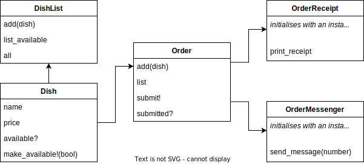

# Takeaway Project Multi-Class Planned Design Recipe

## 1. Describe the Problem

_Put or write the user story here. Add any clarifying notes you might have._

> As a customer  
> So that I can check if I want to order something  
> I would like to see a list of dishes with prices.
> 
> As a customer  
> So that I can order the meal I want  
> I would like to be able to select some number of several available dishes.
> 
> As a customer  
> So that I can verify that my order is correct  
> I would like to see an itemised receipt with a grand total.
>
> As a customer  
> So that I am reassured that my order will be delivered on time  
> I would like to receive a text such as "Thank you! Your order was placed and will be delivered before 18:52" after I have ordered.

## 2. Design the Class System

_Consider diagramming out the classes and their relationships. Take care to
focus on the details you see as important, not everything. The diagram below
uses asciiflow.com but you could also use excalidraw.com, draw.io, or miro.com_



_Also design the interface of each class in more detail._

```ruby
class DishList
  def initialize
  end

  def add(dish) # dish is an instance of Dish
    # returns nothing
  end

  def list_available
    # returns an array of the dishes that are currently available
  end

  def all
    # returns an array of all the dishes, even the ones that aren't currently available
  end
end

class Dish
  def initialize(name, price) # name is a string and price is a float
  end

  def name
    # returns the name of the dish (string)
  end

  def price
    # returns the price of the dish (float)
  end

  def available?
    # returns true if the dish is available, false otherwise
  end

  def set_availability!(bool) # bool is a boolean
    # sets the availability of the dish to whatever value bool is
    # we set the availability as true when initialising an inst
  end
end

class Order
  def initialize
  end

  def add(dish) # dish is an instance of Dish
    # returns nothing
  end

  def list
    # returns a list of all the dishes currently in the order
  end

  def total_price
    # returns a float with total price of the order
  end

  def submit!
    # returns nothing
  end

  def submitted?
    # returns true if the order has been submitted
    # returns false otherwise
  end
end

class OrderReceipt
  def initialize(order) # order is an instance of Order
  end

  def print_receipt
    # returns a string with an itemized receipt of the order
  end
end

class OrderMessenger
  def initialize(order, number) # order is an instance of Order
                                # number is a string containing the phone number to send the reminder message to
  end

  def send_message
    # returns nothing
  end
end
```

## 3. Create Examples as Integration Tests

_Create examples of the classes being used together in different situations and
combinations that reflect the ways in which the system will be used._

```ruby
# DishList and Dish integration
dish_list = DishList.new
dish_1 = Dish.new("Pizza", 5.0)
dish_2 = Dish.new("Pasta", 4.0)
dish_3 = Dish.new("Lasagne", 5.99)
dish_4 = Dish.new("Cheese platter", 12.50)
dish_3.set_availability!(false)
dish_list.add(dish_1)
dish_list.add(dish_2)
dish_list.add(dish_2)
dish_list.add(dish_3)
dish_list.add(dish_4)
dish_list.list_available # => [dish_1, dish_2, dish_4]
dish_list.all # => [dish_1, dish_2, dish_3, dish_4]

# ==============================

# Order integration
# 1 - Check Order adds dishes to its list
order = Order.new
dish_1 = Dish.new("Pizza", 5.0)
dish_2 = Dish.new("Pasta", 4.0)
order.add(dish_1)
order.add(dish_2)
order.list # => [dish_1, dish_2]

# 2 - Throws an error when adding an unavailable dish
order = Order.new
dish_1 = Dish.new("Pizza", 5.0)
dish_1.set_availability!(false)
order.add(dish_1) # raises error "This dish is unavailable"

# 3 - total_price calculates the total price of the order
order = Order.new
order.add(Dish.new("Pizza", 5.0))
order.add(Dish.new("Pasta", 4.0))
order.add(Dish.new("Lasagne", 5.99))
order.total_price # => 14.99

# 4 - OrderReceipt returns a formatted string of each dish, their price and the total price
order = Order.new
order.add(Dish.new("Pizza", 5.0))
order.add(Dish.new("Pasta", 4.0))
order.add(Dish.new("Lasagne", 5.99))
order.add(Dish.new("Cheese platter", 12.50))
order_receipt = OrderReceipt.new(order)
order_receipt.print_receipt # =>
# PIZZA                £5.00
# PASTA                £4.00
# LASAGNE              £5.99
# CHEESE PLATTER      £12.50
# ==========================
# TOTAL               £27.49

# 5 - OrderMessenger sends a text when the order has been submitted
order = Order.new
order.add(Dish.new("Pizza", 5.0))
order.add(Dish.new("Pasta", 4.0))
order.submit!
order_messenger = OrderMessenger.new(order, "07000000000")
order_messenger.send_message # => sends message to 07000000000

# 6 - OrderMessenger raises error when trying to send a message for an order that hasn't been submitted yet
order = Order.new
order.add(Dish.new("Pizza", 5.0))
order.add(Dish.new("Pasta", 4.0))
order_messenger = OrderMessenger.new(order, "07000000000")
order_messenger.send_message # raises error "Cannot send a message for a non submitted order"
```

## 4. Create Examples as Unit Tests

_Create examples, where appropriate, of the behaviour of each relevant class at
a more granular level of detail._

```ruby
# DishList
# 1 - initialized behaviour
dish_list = DishList.new
dish_list.list_available # => []
dish_list.all # => []

# 2 - list_available only returns available dishes
dish_list = DishList.new
dish_1 = double(:fake_dish, available?: true)
dish_2 = double(:fake_dish, available?: false)
dish_3 = double(:fake_dish, available?: true)
dish_list.add(dish_1)
dish_list.add(dish_1)
dish_list.add(dish_2)
dish_list.add(dish_3)
dish_list.list_available # => [dish_1, dish_3]
dish_list.all # => [dish_1, dish_2, dish_3]

# ==============================

# Dish
# 1 - name, price
dish = Dish.new("Pizza", 5)
dish.name # => "Pizza"
dish.price # => 5.0 (ie converts an int to a float)

# 2 - name cannot be empty
dish = Dish.new("", 5.0) # => raises error "Dish must have a name"
dish = Dish.new(nil, 5.0) # => raises error "Dish must have a name"

# 3 - price cannot be negative
dish = Dish.new("Pizza", -5.0) # => raises error "Dish must have a positive price"

# 4 - the dish is initially available
dish = Dish.new("Pizza", 5.0)
dish.available? # => true

# 5 - set_availability! changes the availability of the dish
dish = Dish.new("Pizza", 5.0)
dish.set_availability!(false)
dish.available? # => false
dish.set_availability!(true)
dish.available? # => true

# ==============================

#Order
# 1 - Initial state is empty
order = Order.new
order.list # => []
order.total_price # => 0.0
order.submitted? # => false

# 2 - Adding dishes to the order
order = Order.new
dish_1 = double(:fake_dish, available?: true)
dish_2 = double(:fake_dish, available?: true)
dish_3 = double(:fake_dish, available?: true)
order.add(dish_1)
order.add(dish_2)
order.add(dish_3)
order.list # => [dish_1, dish_2, dish_3]

# 3 - error adding unavailable dishes
order = Order.new
order.add(double(:fake_dish, available?: false)) # => raises error "This dish is unavailable"

# 4 - total_price returns the total price of the order
order = Order.new
order.add(double(:fake_dish, available?: true, price: 5.0))
order.add(double(:fake_dish, available?: true, price: 4.0))
order.add(double(:fake_dish, available?: true, price: 5.99))
order.total_price # => 14.99

# 5 - submit! fails when submitting an empty order
order = Order.new
order.submit! # => raises error "You cannot submit an empty order

# 6 - submit! changes the submission status of the order
order = Order.new
order.add(double(:fake_dish, available?: true))
order.submitted? # => false
order.submit!
order.submitted? # => true

# ==============================

# OrderReceipt
# 1 - print_receipt returns an itemized receipt of an order
dish_1 = double(:fake_dish,
                name: "Pizza", price: 5.0)
dish_2 = double(:fake_dish,
                name: "Pasta", price: 4.0)
dish_3 = double(:fake_dish,
                name: "Lasagne", price: 5.99)
dish_4 = double(:fake_dish,
                name: "Cheese platter", price: 12.5)
order = double(:fake_order, list: [dish_1, dish_2, dish_3, dish_4],
               total_price: 27.49)
order_receipt = OrderReceipt.new(order)
order_receipt.print_receipt # =>
# PIZZA                £5.00
# PASTA                £4.00
# LASAGNE              £5.99
# CHEESE PLATTER      £12.50
# ==========================
# TOTAL               £27.49

# ==============================

# OrderMessenger
# 1 - OrderMessenger sends a text when the order has been submitted
order = double(:fake_order, submitted?: true)
order_messenger = OrderMessenger.new(order, 07000000000)
order_messenger.send_message # => sends message to number

# 2 - OrderMessenger raises error when trying to send a message for an order that hasn't been submitted yet
order = double(:fake_order, submitted?: true)
order_messenger = OrderMessenger.new(order, 07000000000)
order_messenger.send_message # raises error "Cannot send a message for a non submitted order"
```

_Encode each example as a test. You can add to the above list as you go._
